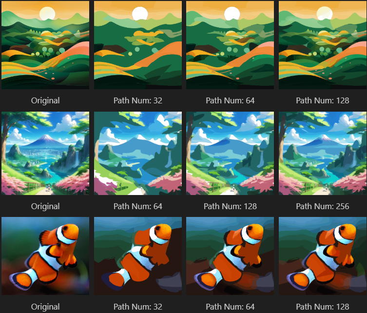

# LIVBOC - Layerwise Image Vectorization via Bayesian-Optimized Contours (VISAPP 2025)
[Ghfran Jabour](https://github.com/ghfranj), 
[Sergey Muravyov](mursmail@gmail.com), 
[Valeria Efimova](valeryefimova@gmail.com), 

We introduce a new image vectorization method that generates SVG images from raster images with the help of Bayesian optimization algorithm to optimize key parameters for extracting contours and turning them into vectors, and the K-means algorithm to extract the suitable colors for these vectors. Then these vectors are optimized to properly align with the targeted shapes.

<br><br>
<div>
      
</div>
<br><br>

In the following image, from left to right we display: 
1) Input image in raster format. 
2) Vectors initialized by the Bayesian optimization and the K-means algorithms. 
3) Vectors being optimized to form the final output.

The image representing a girl is composed of 50 vectors, and the other one representing a deer is composed of 32 vectors.

<div>
    
    
    
</div>
      
<div>
    
    
    
</div>
<br><br><br><br>

## Installation
We suggest users to use the conda for creating new python environment. 

**Requirement**: 5.0<GCC<6.0;  nvcc >10.0.

```bash
git clone https://github.com/CTLab-ITMO/LIVBOC.git
conda create -n livboc python=3.10
conda activate livboc
conda install pytorch torchvision torchaudio pytorch-cuda=11.8 -c pytorch -c nvidia
conda install -y numpy scikit-image
pip install scipy matplotlib scikit-optimize pyyaml pillow
conda install -y -c anaconda cmake
conda install -y -c conda-forge ffmpeg
pip install svgwrite svgpathtools cssutils numba torch-tools scikit-fmm easydict visdom
pip install opencv-python
cd DIFFVG
python setup.py install
cd ..
```


## Run Experiments 
```bash
conda activate livboc
cd LIVBOC
# Please modify the paramters accordingly.
python main.py --config <config.yaml> --experiment <experiment-setting> --signature <given-folder-name> --target <input-image> --log_dir <log-dir>
# Here is an simple example:
python main.py --config config/base.yaml --experiment experiment_50 --signature girl4 --target figures/girl4.png.png --log_dir log/
```

## Acknowledgement
Our implementation is mainly based on the [diffvg](https://github.com/BachiLi/diffvg) codebase. We gratefully thank the authors for their wonderful works.


## LICENSE
LIVBOC is a derivative of the LIVE project and remains under the Apache-2.0 license.


